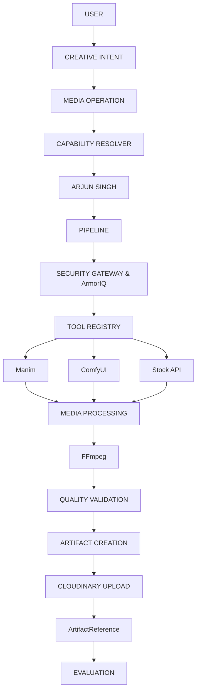

# Creative Media Architecture

This document describes the flow and architecture for creative media generation in Mycel, highlighting how the Creative Team operates without bypassing global infrastructure like Security, Artifact Storage, and the Tool Registry.

## Core Principles

1. **Intent-Based Execution**: Agents do not select tools directly by their implementation name (e.g., "Use Manim"). They express a creative intent (e.g., "Create a technical explainer"), which resolves to a media operation, which in turn selects the best authorized tool.
2. **Global Infrastructure Ownership**: All implementations of tools (FFmpeg, ComfyUI, Manim, Pexels) live in the global `backend/tools/implementations/` layer, not inside individual employee folders.
3. **Artifact-Driven Workflow**: Binary data (videos, images, audio) is never passed raw between agents. Instead, artifacts are generated, stored in temporary storage or Cloudinary, and passed as `ArtifactReference` strings.
4. **Security & Validation**: Every tool execution request goes through ArmorIQ and the Security Gateway to block raw commands and arbitrary file path access.

## Architecture Flow

## Security & ArmorIQ

- **No Arbitrary Commands**: Tools like FFmpeg or Manim receive strict structured parameters. LLM-generated raw shell commands are rejected by the Security Gateway.
- **Sandboxed Workspace**: Tools operate strictly within temporary artifact directories. Path traversal is explicitly blocked.
- **Intent Verification**: ArmorIQ ensures the semantic intent ("Create a 5-second promotional video") matches the operations being executed (e.g., `media.video.compose`).

## Evaluation & Quality

- Outputs are validated for integrity (format, codec, duration) via Quality Gates before being registered as an `ArtifactReference`.
- Workflows that fail (e.g., due to OOM on 8GB VRAM) return structured errors (e.g., `GPU_OUT_OF_MEMORY`, `RESOURCE_LIMIT`), triggering fallbacks to remote API providers if authorized.
