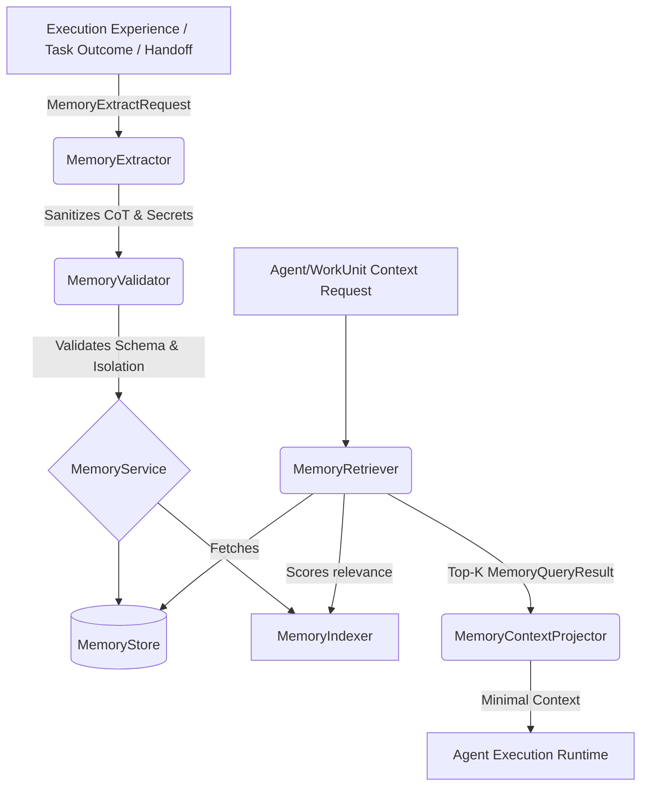

# Memory System Architecture

## Conceptual Flow

## Subsystem Components

1. **`MemoryService`**: Facade service orchestrating storage, extraction, indexing, superseding, and context projection.
2. **`MemoryStore`**: Thread-safe persistence layer handling CRUD operations, status management (`ACTIVE`, `ARCHIVED`, `SUPERSEDED`), and scope filtering.
3. **`MemoryIndexer`**: Lightweight in-memory index computing relevance scores based on keywords, tags, and predefined importance weights (`LOW`, `MEDIUM`, `HIGH`, `CRITICAL`).
4. **`MemoryRetriever`**: Query engine resolving candidates bounded by `MemoryScope`, allowing optional fallback logic (e.g. querying `TEAM` falls back to `ORGANIZATION` defaults).
5. **`MemoryExtractor`**: Intelligence component distilling unstructured experiences into concise `MemoryItem` records. Strips non-compliant chain-of-thought traces (`<think>`) and regex-matches common credential formats.
6. **`MemoryContextProjector`**: Reduces `MemoryItem` entities into lean dictionaries for LLM ingestion, drastically minimizing context window pressure.

## State Transitions
- **`ACTIVE`**: Readily retrievable and scoreable.
- **`SUPERSEDED`**: Replaced by a newer version (contains `superseded_by` pointer). Will not be returned by standard queries.
- **`ARCHIVED`**: Soft-deleted from active index.
