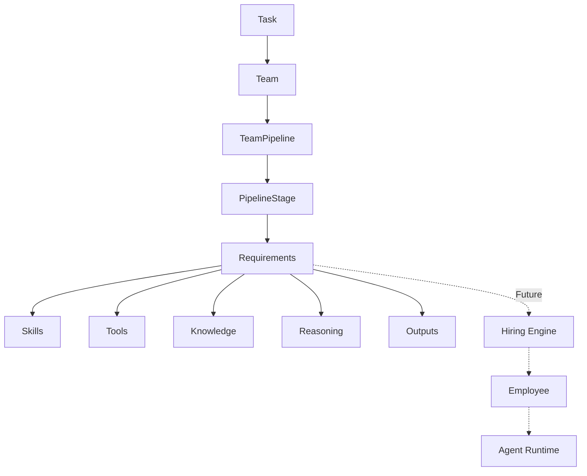

# Pipeline Architecture

The Pipeline Architecture acts as the connective tissue between the abstract Team capabilities and the future execution layer.

## Independence of Domains
- **Skills**: Pipeline refers to `skill_id`. The actual skill lives in the `Workforce/Tools` domain.
- **Tools**: Pipeline refers to `tool_id`. The actual tool lives in the `ToolRegistry`.
- **Reasoning**: Pipeline refers to `reasoning_strategy_id`. The actual logic is in `ReasoningEngine`.
- **Outputs**: Pipeline refers to `expected_output_type`. `ArtifactSystem` validates it.
