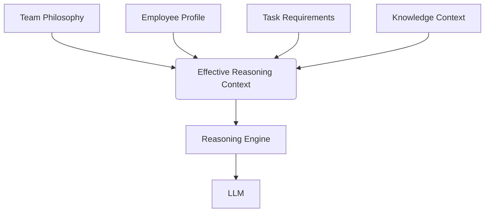

# Reasoning Composition

*(Note: The full composition engine is scheduled for a future Agent/Runtime phase. This document serves as the architectural roadmap.)*

## The Problem
An Agent executing a task belongs to a Team, holds a Position, possesses personal Capabilities, and operates within a specific Context. How do we resolve what reasoning strategy to use?

## The Future Composition Model
The final reasoning context will be a composition of:

1. **Team Philosophy**: High-level domain methodology (established in TOS 5).
2. **Position Requirements**: Specific reasoning constraints for a role.
3. **Employee Reasoning Profile**: The personal reasoning traits of the agent executing the work.
4. **Task Requirements**: One-off instructions for the specific job.
5. **Knowledge Context**: The RAG context defining what is known.
6. **Tool Availability**: What actions are currently permitted.

