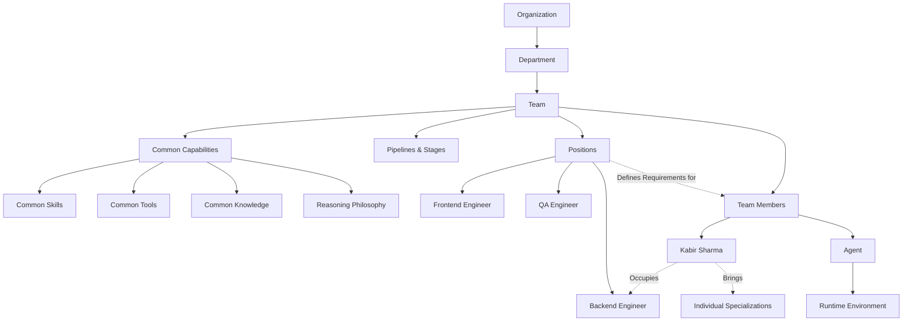

# Team Workforce Blueprint

This blueprint describes the structural relationship between structural definitions, human identities, and execution runtimes in the Mycel Team Operating System.

## Layers of Abstraction

1. **Team (The Domain):** Owns pipelines, quality gates, output contracts, and common standards.
2. **Position (The Requirement):** Belongs to the Team. Defines the exact responsibilities, skills, tools, and headcount needed for a specific seat in the Team.
3. **Team Member (The Assignment):** The actual workforce employee occupying the seat, bringing their unique identity, specializations, and personality.
4. **Agent (The Executor):** The LLM-driven entity that is spun up dynamically based on the Team Member's profile and the Position's capabilities.
5. **Runtime (The Environment):** The sandbox context managing lifecycle, state, timeouts, and boundaries for the Agent.
