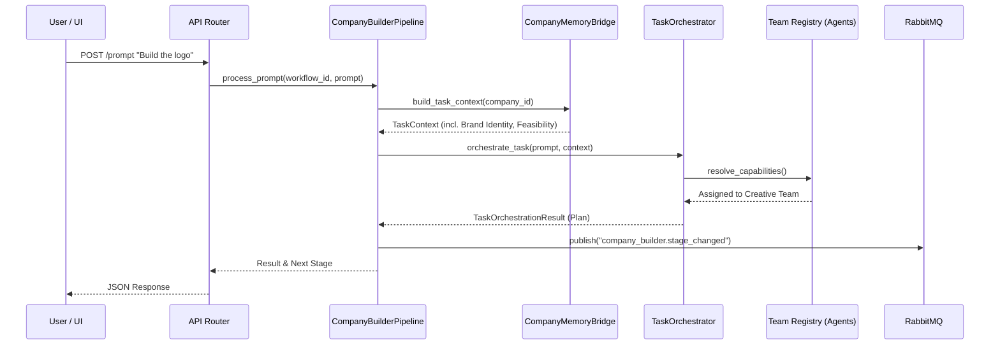

# Autonomous Company Builder Architecture

This document outlines the architecture for the **Autonomous Company Builder** domain within the Mycel framework. This system enables users to progressively build a company from scratch (Feasibility -> Growth Strategy -> Brand -> Logo -> Poster -> Website -> Pitch Deck) through sequential prompts, without manually selecting teams or managing context.

## Core Architectural Components

### 1. Stateful Pipeline Engine (`CompanyBuilderPipeline`)
The Pipeline Engine is a state machine that tracks the lifecycle of the company building process. It persists the current stage of the workflow and defines the transition logic between phases.
- **Location**: `backend/domains/company_builder/pipeline.py`
- **Responsibilities**:
  - Maintains `CompanyBuilderState` (Current Stage, Completed Stages, Artifacts).
  - Determines which orchestration logic to run based on the `BuilderStage`.
  - Publishes real-time transition events to RabbitMQ (`company_builder.{id}.stage_changed`).

### 2. Context Memory Bridge (`CompanyMemoryBridge`)
To achieve true autonomy, the user should never have to repeat previous decisions. The Memory Bridge hooks directly into the core `MemoryService`.
- **Location**: `backend/domains/company_builder/memory_bridge.py`
- **Responsibilities**:
  - Queries `MemoryScope.ORGANIZATION` for the specific `company_id`.
  - Injects previously generated constraints (e.g., brand guidelines, target audience) directly into the `TaskContext`.
  - Ensures the LLM agents have access to the complete history of the company build process.

### 3. Task Orchestrator & Capability Resolver
Rather than hardcoding specific agents, the pipeline leverages Mycel's `TaskOrchestrator` to automatically assign work based on capabilities.
- **Parallel Dispatch**: During `FEASIBILITY_ANALYSIS`, the pipeline simultaneously dispatches three separate prompts for Legal, Finance, and Research.
- **Capability Matching**: The `TeamCapabilityResolver` analyzes the requested output and automatically assigns it to the capable team.

### 4. API & Event Layer
The system exposes a REST API via FastAPI, fully decoupled from the UI to support multi-client usage.
- **Endpoints**: 
  - `POST /api/company-builder/init`: Initializes a new state machine.
  - `POST /api/company-builder/prompt`: Submits user requirements and triggers orchestration.
- **Events**: Utilizes `rabbitmq_producer` to stream asynchronous updates.

---

## Architectural Diagram


The following Mermaid diagram illustrates the data flow when a user submits a sequential prompt.



## Data Models

```python
class BuilderStage(str, Enum):
    COMPANY_INITIALIZATION = "COMPANY_INITIALIZATION"
    REQUIREMENTS_DISCOVERY = "REQUIREMENTS_DISCOVERY"
    FEASIBILITY_ANALYSIS = "FEASIBILITY_ANALYSIS"
    GROWTH_STRATEGY = "GROWTH_STRATEGY"
    BRAND_IDENTITY = "BRAND_IDENTITY"
    LOGO_CREATION = "LOGO_CREATION"
    POSTER_CREATION = "POSTER_CREATION"
    WEBSITE_CREATION = "WEBSITE_CREATION"
    PITCH_DECK_CREATION = "PITCH_DECK_CREATION"

class CompanyBuilderState(BaseModel):
    workflow_id: str
    company_id: str
    workspace_id: str
    current_stage: BuilderStage
    completed_stages: List[BuilderStage]
    pending_stages: List[BuilderStage]
    artifacts: Dict[str, ArtifactReference]
    tasks: List[str]
```
