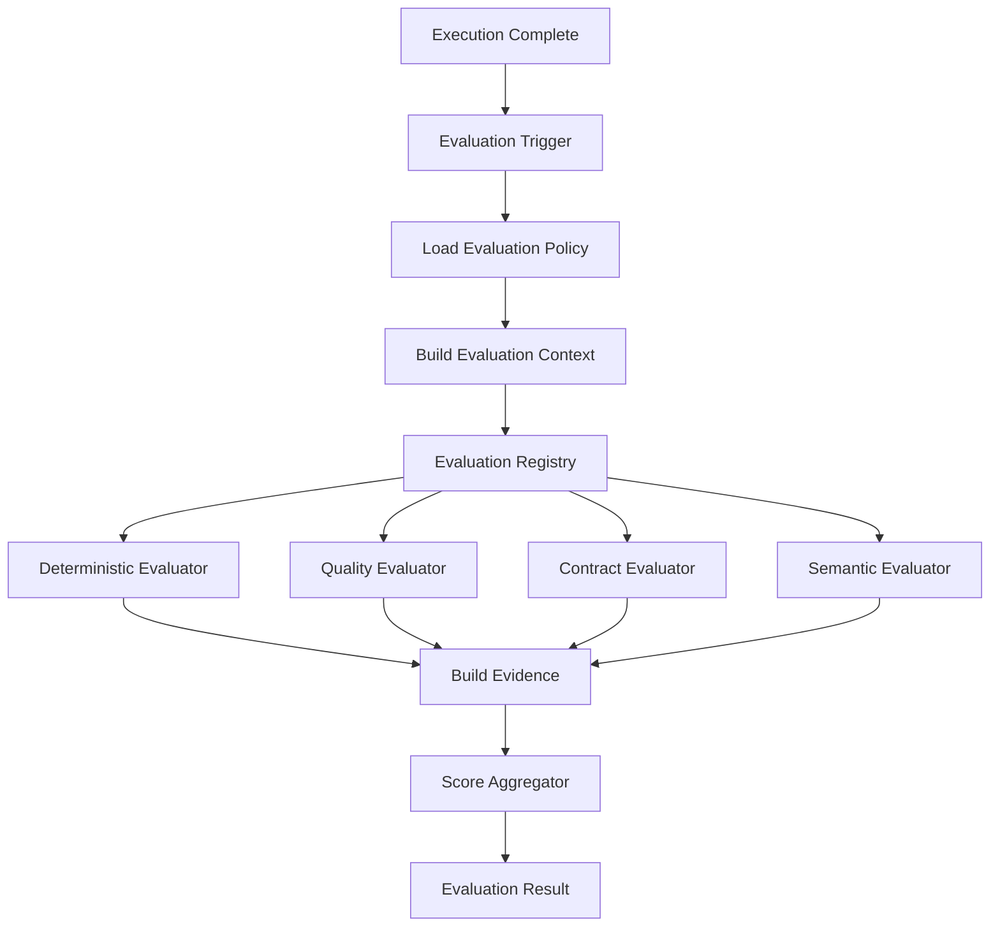

# Evaluation Architecture

The Mycel Evaluation System acts as an observational overlay that measures the quality, correctness, efficiency, and reliability of execution without mutating runtime state. 

## Architectural Flow

1. **Execution**: A Task, WorkUnit, or Artifact generation finishes its core logic.
2. **Evaluation Trigger**: An event or synchronous API call triggers the orchestrator, passing in the relevant identifiers (e.g., `TaskID`).
3. **Evaluation Policy**: The Orchestrator resolves the `EvaluationPolicy` appropriate for the target. The policy dictates which dimensions to evaluate, their weights, and security boundaries (like whether semantic evaluation is allowed).
4. **Evaluator Registry**: For each dimension in the policy, the Orchestrator requests the appropriate `Evaluator` from the `EvaluationRegistry` based on the specified `EvaluationMethod` (e.g., `DETERMINISTIC`, `CONTRACT_BASED`).
5. **Evaluators**: The selected evaluator executes its isolated logic against the `EvaluationContext` (which is strictly scoped to the minimal required data).
6. **Evidence**: Evaluators generate `EvaluationEvidence` pointing to the exact sources (like a `QualityGateResult` or a specific file schema).
7. **Aggregation**: The `EvaluationAggregator` receives the dimension scores, handles missing values (`NOT_EVALUATED`), and applies policy weights to compute the final score. Deterministic failures mark the evaluation as `PARTIAL` or `FAILED`.
8. **Evaluation Result**: The final `Evaluation` entity is securely persisted into the MongoDB-backed `EvaluationRepository`.

