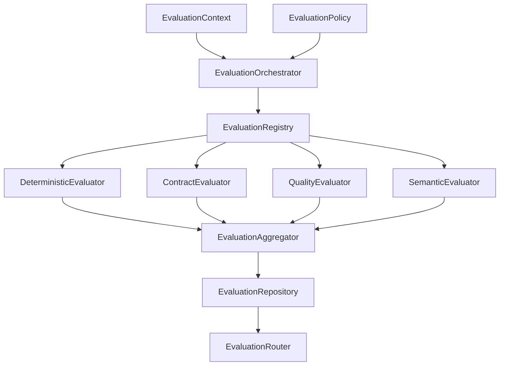

# Phase 13: Evaluation System

## Overview
The Evaluation System is an observational layer in the Mycel AI Company Operating System. It measures the quality, correctness, efficiency, and reliability of execution (Tasks, WorkUnits, Outputs, Teams) without mutating execution state.

## Core Principles
1. **Observation Only**: The system observes and scores; it does not retry tasks or mutate memory.
2. **Determinism First**: Evaluators prioritize deterministic checks (e.g., artifact existence, schema validation) before relying on subjective semantic evaluations.
3. **Decoupled Quality**: It integrates `QualityGateResult`s as evidence without re-running the quality checks themselves.

## Architecture

### Components
- **`EvaluationContext`**: The minimal required dataset for an evaluation (Task, WorkUnit, Artifacts, Quality Results).
- **`EvaluationPolicy`**: Defines the target, required dimensions, their weights, and explicit permissions (e.g., `allows_semantic`).
- **`EvaluationRegistry`**: A mapping of `EvaluationMethod` to specific, isolated Evaluators.
- **`EvaluationAggregator`**: Computes weighted scores and identifies partial/critical failures for missing required dimensions.
- **`EvaluationRepository`**: Provides thread-safe, versioned CRUD operations over `Evaluation` entities.

## Policy & Security
- **Explicit Allow-list**: `LLM_ASSISTED` semantic evaluators are only invoked if the `EvaluationPolicy.allows_semantic` flag is explicitly set to `True`.
- **No Side Effects**: Evaluators are strictly bound to a read-only interface and cannot modify system state or request capability execution.

## Future Hooks
In subsequent phases, the `EvaluationOrchestrator` is positioned to be triggered via asynchronous event queues (e.g., RabbitMQ) hooked onto `TaskStatus.COMPLETED` or `QualityGateDecision` events.
