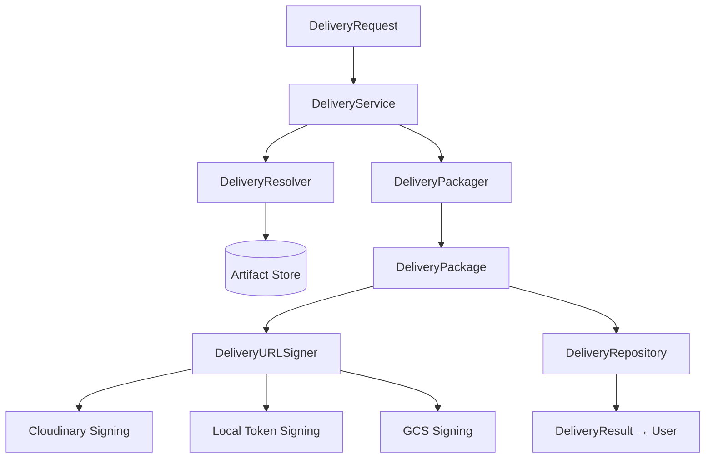

# Phase 14: Output Delivery System

## Purpose
The Output Delivery System is the final mile of the Mycel execution pipeline. It takes internally-stored Artifacts, packages them against their `OutputContract`, signs time-limited download URLs, and surfaces a structured `DeliveryResult` to the consumer.

## Position in the Pipeline
```
TASK EXECUTION → QUALITY GATES → EVALUATION → OUTPUT DELIVERY → USER
```

## Architecture



## Components

| Component | File | Responsibility |
|---|---|---|
| `DeliveryService` | `service.py` | Orchestration facade |
| `DeliveryResolver` | `resolver.py` | Artifact → DeliveryItem mapping |
| `DeliveryPackager` | `packager.py` | Assemble DeliveryPackage from items |
| `DeliveryURLSigner` | `signer.py` | Sign time-limited URLs per provider |
| `DeliveryRepository` | `repository.py` | Versioned persistence |

## Delivery Formats
- **DIRECT_URL**: Single artifact, signed URL returned directly
- **DOWNLOAD_BUNDLE**: Multiple artifacts grouped (auto-coerced from DIRECT_URL when >1 item)
- **INLINE**: Small payload embedded in the response body
- **REFERENCE**: Opaque storage reference for internal consumers

## Security
- Signed URLs are time-limited (default 1 hour, configurable per request)
- Private signing keys are never stored in process — read from environment at call time
- Delivery respects task ownership; authorization enforced at service boundary

## Non-Goals
- Does NOT generate artifacts
- Does NOT re-run Quality Gates or Evaluations
- Does NOT store artifact binaries
- Does NOT modify TaskPlan
