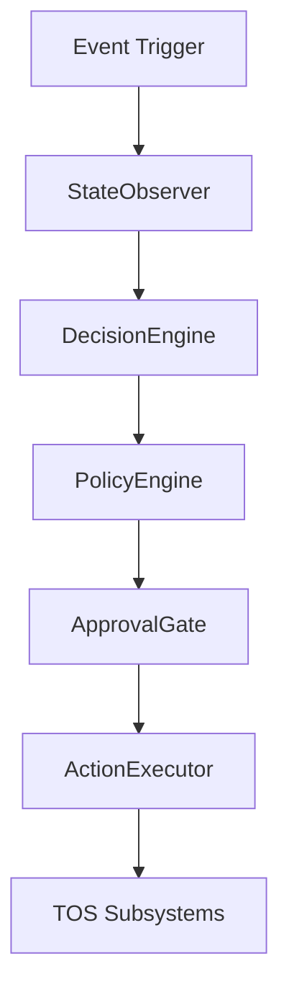

# Phase 16: Autonomous Company

## Overview

The Autonomous Company is the capstone control layer of the Mycel Operating System. It introduces the ability for the system to pursue long-term, multi-step `CompanyObjective`s without constant human micromanagement.

Crucially, **Autonomy is a Control Layer**. It does not perform work directly. Instead, it observes the state of the organization, determines the next logical action, checks policies, and delegates execution to the existing Team Operating System (TOS) subsystems (Task Orchestrator, Talent Market, Quality Gates).

## Core Principles

1.  **No Black-Box Autonomy:** Every decision must be recorded with an explicit `reason`, `evidence`, and `trigger`. LLMs are used for planning, but the core control loop uses deterministic state machines.
2.  **Least Privilege Validation:** The autonomy engine cannot modify its own policies, grant itself permissions, or bypass the kill switch.
3.  **Strict State Machine:** Objectives follow a rigid lifecycle (DRAFT → ACTIVE → PLANNING → EXECUTING → COMPLETED/FAILED/PAUSED/CANCELLED) enforced by the `ObjectiveManager`.
4.  **Quality is Authoritative:** Task completion is only recognized for progress if the task has passed its Quality Gate. 
5.  **Fail-Safe by Default:** Pathological patterns (like infinite retry loops) are detected and escalated. Budgets and concurrency limits act as hard ceilings.

## Components

The architecture decomposes the control loop into stateless, highly testable subsystems:

*   **ObjectiveManager:** Enforces the lifecycle state machine.
*   **Planner & ReplanningEngine:** Converts objectives into versioned `CompanyPlan`s (DAGs of tasks).
*   **StateObserver:** Ingests live data from TOS and builds a lightweight `CompanyStateSnapshot`.
*   **ProgressTracker:** Computes a strict 0.0 – 1.0 progress metric.
*   **DecisionEngine:** Determines the next action (CREATE_TASK, WAIT, REPLAN, ESCALATE) based on the state snapshot.
*   **PolicyEngine:** Evaluates proposed decisions against organizational constraints (budgets, concurrency).
*   **ApprovalGate:** Determines if a decision requires human intervention based on risk and Autonomy Level.
*   **ActionExecutor:** Dispatches the approved decision to the relevant TOS system.

## The Autonomy Loop

The loop is driven by events (or scheduled ticks). 
`Observe → Plan → Decide → Validate → Execute`.

